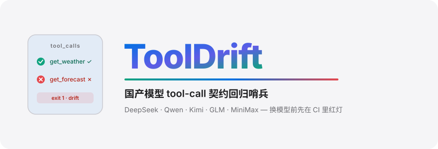
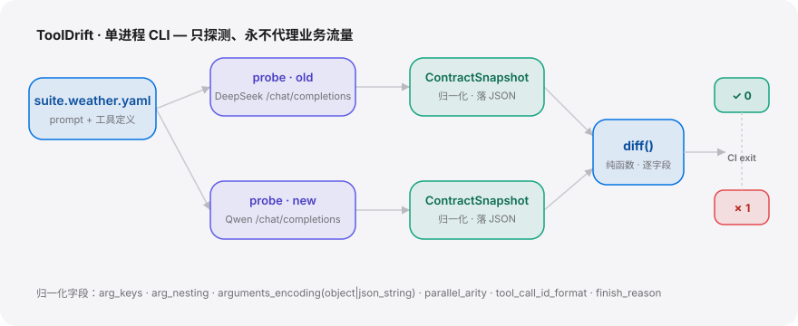

<div align="right"><sub><a href="./README.en.md">English</a>&nbsp;&nbsp;⇄&nbsp;&nbsp;<b>简体中文</b></sub></div>

<p align="center">
  <picture>
    <source media="(prefers-color-scheme: dark)" srcset="./assets/hero-dark.svg">
    <source media="(prefers-color-scheme: light)" srcset="./assets/hero-light.svg">
    
  </picture>
</p>

<p align="center"><sub>国产模型 tool-call 契约回归哨兵：换 DeepSeek / Qwen / Kimi / GLM / MiniMax 前，CI 先红灯告诉你哪个工具的 schema 不再等价。</sub></p>

<p align="center">
  <a href="./LICENSE"></a>
  <a href="https://github.com/SuperMarioYL/tooldrift/releases"></a>
  <a href="https://github.com/SuperMarioYL/tooldrift/actions/workflows/tooldrift.yml"></a>
  
  
  
</p>

> **把「换模型上线后才发现 function-calling 静默坏掉」提前成一次切换前的 `diff`。** 同一份工具套件分别打两家国产模型的 OpenAI-兼容 `/chat/completions`，把各自的 `tool_calls` 归一化成可对账的契约快照，逐字段比对——等价亮绿，不等价亮红并精确指出差异点，drift 时进程非零退出，直接挂进 CI。

ToolDrift 不是「Promptfoo 的中文版」，也不是统一 API / 路由。它接的是一块**没人守护的地**：DeepSeek-Reasonix 这类**绑死单一国产模型**的 [Coding Agent](https://github.com/Hmbown/DeepSeek-TUI) 很火，但它们结构上不做「换走时 tool-call 契约是否还等价」的交叉校验；通用 eval 框架（Promptfoo）只断言文本输出，刻意不内化任一家的协议怪癖。当 MiniMax-M2 这类被 [sermakarevich](https://twitter.com/sermakarevich) 反复讨论的 **X27** 级 agent 模型把「tool-calling 好」当卖点推、而国产模型价格战让「换供应商砍成本」成为每月运维动作时，「换模型 → function-calling 静默坏掉」就从偶发变成系统性风险。ToolDrift 命名并守护「跨国产模型 tool-call 契约等价性」这个新原语——它是绑死方叙事的对偶：站在**迁移方**，帮你安全地换走。

---

## 目录

- [架构](#架构)
- [为什么需要它](#为什么需要它)
- [安装](#安装)
- [快速开始](#快速开始)
- [用法](#用法)
- [Demo](#demo)
- [五家 `tool_calls` 对比表](#五家-tool_calls-对比表)
- [配置](#配置)
- [付费层 · 托管契约漂移看板](#付费层--托管契约漂移看板)
- [路线图](#路线图)
- [对比 DeepSeek-Reasonix](#对比-deepseek-reasonix)
- [License](#license)

---

##  架构

单进程 CLI，无服务、无数据库、**永不代理业务流量**——只读各家端点、归一化、比对。

<p align="center">
  <picture>
    <source media="(prefers-color-scheme: dark)" srcset="./assets/atlas-dark.svg">
    <source media="(prefers-color-scheme: light)" srcset="./assets/atlas-light.svg">
    
  </picture>
</p>

核心原语是 **`ContractSnapshot`**：把每家模型吐 `tool_calls` 的「形状」提炼成一份可 diff 的快照——

```text
ContractSnapshot
├─ provider / model_id            # 契约绑定到具体模型/版本
└─ tools: { tool_name -> ToolCallShape }
                                  ToolCallShape
                                  ├─ emitted            该工具是否被调出
                                  ├─ arg_keys           arguments 顶层键集合（排序后）
                                  ├─ arg_nesting        每个参数的 JSON 类型/嵌套形状
                                  ├─ arguments_encoding  object | json_string
                                  ├─ parallel_arity     并行 tool_calls 的数量语义
                                  ├─ tool_call_id_format  openai | custom | absent
                                  └─ finish_reason      "tool_calls" vs 其它取值
```

`diff(a, b)` 在 `tool_name` 上对齐两份快照、逐字段判等价，产出 `[ToolDelta]`——这正是 Promptfoo（断文本）和 DeepSeek-Reasonix（绑死一家）结构上都**不会**做的那块。

##  为什么需要它

每家国产模型把 `tool_calls` **吐得都不一样**、且不向后兼容：参数名变了、`arguments` 从对象变字符串、并行调用的数组语义不同、`finish_reason` 取值不同。改一行 `base_url`/`model_id`、跑通几个聊天 prompt 就上线，结果某个工具的 schema 静默漂移，agent 在生产里调错工具或调不出工具。这是**逐模型(per-model)的契约漂移**，通用文本 eval 覆盖不到。ToolDrift 把它前移成切换前 CI 里的一盏红绿灯。

##  安装

```bash
pip install tooldrift          # 或： uv tool install tooldrift
```

国内打不开 PyPI？克隆仓库后 `pip install -e .` 即可（仅 5 个纯 Python 依赖）。

##  快速开始

**零 API key 先看到红绿**——所有命令都支持 `--from-fixtures`，回放 `tests/fixtures/` 里的离线样本：

```bash
tooldrift snapshot --base deepseek --from-fixtures              # 抓一份契约快照
tooldrift run --old deepseek --new qwen --from-fixtures         # 跨两家比对，drift 时非零退出
echo "CI exit code: $?"                                          # → 1（捕获到漂移）
```

<details><summary>样例输出（DeepSeek → Qwen 切换捕获到 2 处契约漂移）</summary>

```text
ToolDrift deepseek/deepseek-chat  →  qwen/qwen-plus   suite=weather
  ✗ get_forecast contract drift
      arg_keys            days, include, location, unit  →  days, location
      arg_nesting:days    integer                        →  string
      arguments_encoding  json_string                    →  object
      tool_call_id_format openai                         →  custom
      finish_reason       tool_calls                     →  stop
  ✗ get_weather contract drift
      arguments_encoding  json_string                    →  object
      tool_call_id_format openai                         →  custom
      finish_reason       tool_calls                     →  stop
╭──────────────────────────────────────────────────╮
│ FAIL — BREAKING drift in 2 of 2 tool(s). Exit 1. │
╰──────────────────────────────────────────────────╯
```

</details>

接真实端点：把各家 key 写进环境变量（`DEEPSEEK_API_KEY`、`DASHSCOPE_API_KEY`…，见 [`examples/contract.yaml`](./examples/contract.yaml)），去掉 `--from-fixtures` 即可。

##  用法

四个子命令，对应 OSS 核心：

```bash
# 1) snapshot —— 抓一家的契约快照，落 JSON（契约绑定到具体版本）
tooldrift snapshot --base deepseek --suite examples/suite.weather.yaml -o snapshots/deepseek.json

# 2) diff —— 纯离线比对两份已落地的快照（无网络），drift 即非零退出
tooldrift diff snapshots/deepseek.json snapshots/qwen.json

# 3) run —— 一行式 CI 入口：探测 old vs new、比对、红绿报告 + 退出码
tooldrift run --old deepseek --new qwen --suite examples/suite.weather.yaml

# 3b) run --contract —— 加载 contract.yaml（声明 provider + 可选 pinned `expected` 契约），
#     探测 --base 各家、两两比对 AND 各自回归到 pinned 契约，任一漂移即非零退出
tooldrift run --contract examples/contract.yaml --base deepseek --base qwen --from-fixtures

# 任意 run / diff 都可加 --format json，输出机器可读的 ContractDiff JSON，
# 供 CI 与托管的 drift-watch 看板直接解析（不再是终端色块）
tooldrift diff snapshots/deepseek.json snapshots/qwen.json --format json

# 4) compare-table —— 跨五家产出可传播的 Markdown 对比表
tooldrift compare-table --from-fixtures -o COMPARISON.md
```

更多示例见 [`examples/`](./examples/)。把第 3 行直接写进 CI（见下方路线图里的 `.github/workflows/tooldrift.yml`），换模型 PR 上 schema 不等价就 fail。

##  Demo


> 同样的 30 秒流程也有 asciinema 录像：[`assets/demo.cast`](./assets/demo.cast)。

##  五家 `tool_calls` 对比表

`tooldrift compare-table` 跑一次的副产品——这张表本身就是最好的传播钩子（下表为离线 fixture 实测，标 `Δ` 的行即跨家不等价点）：

### `tool_calls` contract comparison — suite `weather`

| tool | field | deepseek | qwen |
|---|---|---|---|
| **get_forecast** | emitted | ✓ | ✓ |
|  | **Δ arg_keys** | `days, include, location, unit` | `days, location` |
|  | **Δ args_encoding** | `json_string` | `object` |
|  | parallel_arity | 1 | 1 |
|  | **Δ id_format** | `openai` | `custom` |
|  | **Δ finish_reason** | `tool_calls` | `stop` |
| **get_weather** | emitted | ✓ | ✓ |
|  | arg_keys | `location, unit` | `location, unit` |
|  | **Δ args_encoding** | `json_string` | `object` |
|  | parallel_arity | 1 | 1 |
|  | **Δ id_format** | `openai` | `custom` |
|  | **Δ finish_reason** | `tool_calls` | `stop` |

> 接上五家真实 key 后，`tooldrift compare-table` 会把 kimi / glm / minimax 三列也填满。

##  配置

`contract.yaml` 顶层键（完整示例见 [`examples/contract.yaml`](./examples/contract.yaml)）：

| 键 | 类型 | 默认 | 含义 |
|---|---|---|---|
| `version` | int | `1` | 契约文件格式版本 |
| `suite` | path | — | 引用的工具套件 YAML（prompt + 工具定义） |
| `providers` | map | — | 受测 provider 列表：每家 `base_url` / `model_id` / `api_key_env` |
| `providers.<p>.api_key_env` | str | — | 读 key 的环境变量名——key **从不**写进文件或快照 |
| `expected` | map | *(可选)* | 钉死一份「已知良好」契约，让 `run` 回归每家是否仍满足它 |

##  付费层 · 托管契约漂移看板

OSS 核心（`snapshot / diff / run / compare-table` CLI）**永久免费**，护城河是开放的契约快照格式。商业层是**托管的「契约漂移看板」**——持续对五家最新 API 定时回归，新版本一发就推送告警（如「GLM 又改了 `arguments` 字符串化」），按团队订阅：

| 档位 | 价格 | 内容 |
|---|---|---|
| **Team** | ¥499/月 | 托管定时回归 + 五家变更告警（邮件 / 飞书 / 钉钉 webhook）+ 私有 contract 托管 |
| **Enterprise** | ¥2,999/月起 | 私有部署、报告留痕（信创 / 政企合规交付）、五家之外按需适配（豆包 / 百川） |

首付费客户来自**承诺「支持多家国产模型」的 agent 中间件 / 框架团队**——他们每接一家新模型都是盲跳，最有动机为现成等价性测试 + 协议变更订阅付费。看板本身不在本仓库范围内（CLI 已埋好开关与文档接缝）；想试用托管层请提 issue 联系。

##  路线图

- [x] **m1** · `snapshot` 探测一家、归一化 `ContractSnapshot`、落 JSON
- [x] **m2** · `diff` 纯函数 + `run` 红绿报告 + CI 非零退出码
- [x] **m3** · `compare-table` 跨五家产出对比 Markdown 表
- [x] **m4** · CI 模板（`.github/workflows/tooldrift.yml`）+ demo + 双语 polished README + 货币化接缝
- [ ] 流式 tool-call（SSE delta）重组
- [ ] 五家之外的模型适配（豆包 / 百川…，付费按需）
- [ ] 托管「契约漂移看板」SaaS（付费层）

##  对比 DeepSeek-Reasonix

诚实定位——ToolDrift 站在迁移方，是绑死方的对偶，不踩对方赛道：

| 维度 | ToolDrift | [DeepSeek-Reasonix](https://github.com/esengine/DeepSeek-Reasonix) |
|---|---|---|
| 目标 | 跨国产模型 tool-call 契约**等价性回归** | 围绕 DeepSeek **一家**把 agent 工程化到极致 |
| 单模型深度 / prefix-cache 工程 | — | ✓（这是它 2.5 万星的护城河） |
| 跨模型迁移安全（换走时是否等价） | ✓ | —（结构上不做，做了会消解 DeepSeek-native 卖点） |
| 即开即用的 agent 终端体验 | partial（CLI 工具，非 agent） | ✓ |
| 进 CI 的红绿退出码 | ✓ | — |

##  License

[MIT](./LICENSE)。欢迎提 [issue](https://github.com/SuperMarioYL/tooldrift/issues) 描述你的真实迁移场景，或 PR 贡献一家新 provider 的适配。

## Share this

```
ToolDrift — 国产模型 tool-call 契约回归哨兵。换 DeepSeek/Qwen/Kimi/GLM/MiniMax 前，
CI 先红灯告诉你哪个工具 schema 不再等价。Agent 迁移方的对偶。 https://github.com/SuperMarioYL/tooldrift
```

<p align="center"><sub><a href="./LICENSE">MIT</a> © 2026 SuperMarioYL</sub></p>
